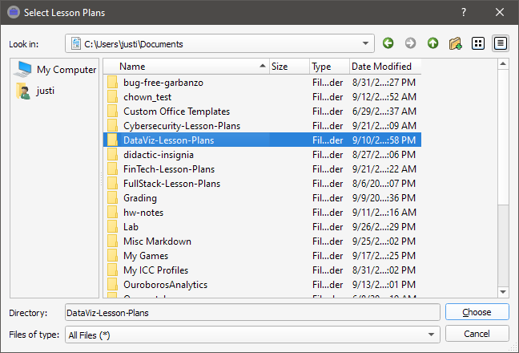
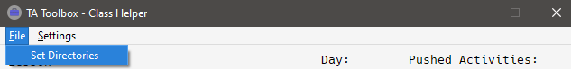
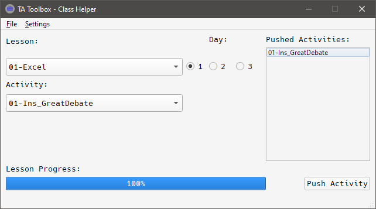
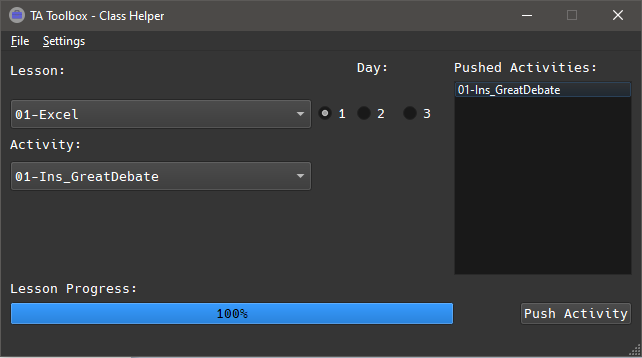

# Class Helper

<!--  -->

## Setup

To 'install' Class Helper, navigate to the repository and run `sh setup.sh`. This will install the requirements and setup the virtual environment. When it completes, you won't need to run the setup script again. Run `sh run.sh`, to activate the virtual environment and start the application.

The first time Class Helper is run, you will see a window asking you to select a Lesson Plans directory. Choose the lesson plans directory corresponding to the course you would like to work with. Handling multiple classes is in the works but for now you can only select one class to work with. The next window is for the class repo. The third and final window of the setup process will ask you to choose a class day from the list of folders in the class repo. A toggle is in the works for swapping class days or if the class only has one set of days.

After selection, Class helper will open. Your settings are saved so you won't see the setup windows again unless you choose to change the source directories in the file menu.

## Class Helper UI

Once inside Class Helper, you'll see two dropdowns. The top dropdown labeled `Lesson:` is populated with all the lessons in the lesson plans directory. The bottom, labeled `Activity:` is populated with all the activities in the currently selected lesson. _By default_ the activities are for the first day of the first lesson. To the right of the dropdowns is a set of radio buttons, labeled 1, 2, or 3.
These correspond to the day of the lesson (subdirectory) you want to work with. _By default_ it is set to 1. The rightmost element is the `Pushed Activities` box which is populated by parsing the gitignore for commented activities in the lesson level .gitignore with the suffix `Solved`.

**Note**: Because the dropdowns are populated from the lesson plans, there may (and should be) lessons that do not _yet_ exist in the class repo. If you click on those you will get an error message that let's you know that file path doesn't exist in the class repo.

## Using Class Helper

Select a lesson from the lesson, day, and activity and then click the `Push Activity` button in the lower right. **_WARNING_**: As of 2019/09/27 this button is connected to the git commands. It will attempt to comment, pull, commit, and push to your selected class repository. To deactivate this, comment out lines 117-124 in `utils.py`. If you want to test functionality, replace with `print(commit_msg)` to print the _would be_ commit message.

## Settings

Under the settings tab you can choose the push style:

- One Activity - Push out the solutions for the current activity with the unsolved for the next activity.
- All Unsolved - Push out all unsolved at the beginning of a lesson and push out solutions for individual activities.

You can also select the format of the commit message:

- Lesson_Name - Solved
- 00 - Solved
- 00-Lesson_Name - Solved

and last but not least, Dark Mode:

